# proyecto-sd-taskflow
Proyecto - 2P - Sistemas Distribuidos

TaskFlow — Sistema de Gestión de Tareas distribuido entre dos máquinas y dos clústeres Kubernetes independientes, comunicados por Tailscale.

## Backend — Juan Diego (Máquina A)

Node.js + Express + Mongoose + MongoDB + JWT + bcryptjs, contenerizado y desplegado en Kubernetes: Backend con `NodePort 30080` (2 réplicas iniciales, escalable a 4) y MongoDB con `ClusterIP` (1 réplica).

- Código: `backend/`
- Manifiestos de Kubernetes: `kubernetes/maquina-a/`
- Imagen publicada: [`juandifrost17/taskflow-backend:v2`](https://hub.docker.com/r/juandifrost17/taskflow-backend)

### Correr tests localmente

Los tests (`backend/tests/`) usan una base MongoDB real, no mocks. Antes de correr `npm test` necesitas un MongoDB accesible:

```bash
docker run -d --name taskflow-mongo-dev -p 27017:27017 mongo:8.0
```

Luego, desde `backend/`:

```bash
npm install
npm test
```

Por defecto los tests se conectan a `localhost:27017` y usan la base `taskflow_test` (separada de la de desarrollo/seed) para no pisar datos. Se puede sobreescribir con variables de entorno:

```bash
MONGO_HOST=localhost MONGO_PORT=27017 MONGO_DATABASE=taskflow_test npm test
```

Para un flujo de humo end-to-end contra un servidor ya corriendo (local, en Docker o vía Tailscale/NodePort):

```bash
BASE_URL=http://localhost:3000 ./scripts/smoke-api.sh
```

Requiere `jq` instalado.

### Datos de prueba

```bash
cd backend
npm run seed
```

Crea 2 usuarios de prueba con tareas variadas (ver `backend/scripts/seed.js` para credenciales).

### Evidencias — Máquina A

Kubernetes con 2 Pods de Backend + 1 Pod de MongoDB, servicios correctos (`NodePort`/`ClusterIP`), conectividad por Tailscale, y el escalado en vivo de 2 a 4 réplicas.

| | |
|---|---|
| 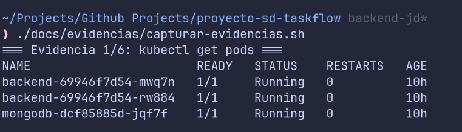 | 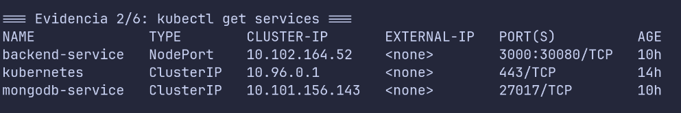 |
| `kubectl get pods` | `kubectl get services` |
| 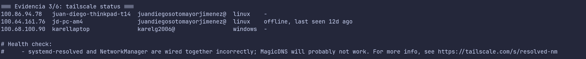 | 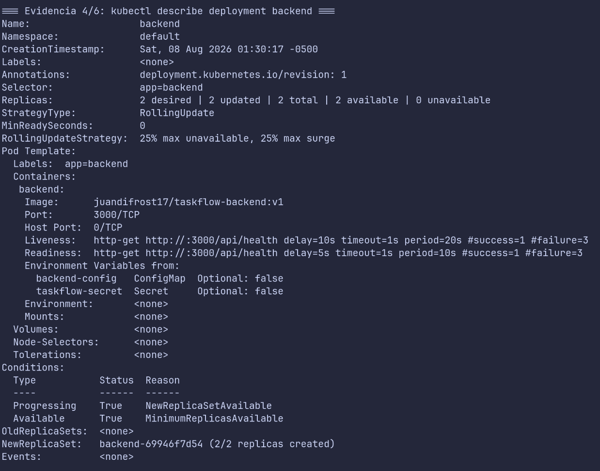 |
| `tailscale status` | `kubectl describe deployment backend` |
| 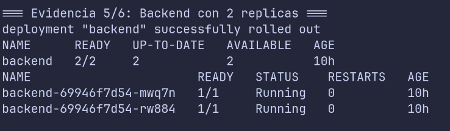 | 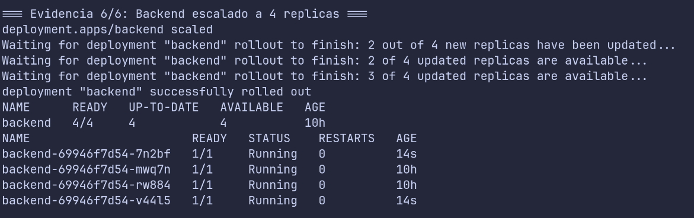 |
| Backend con 2 réplicas (estado inicial) | Backend escalado a 4 réplicas |

## Frontend — Karel (Máquina B)

React 18 + Vite + Tailwind CSS + React Router + FullCalendar, servido con Nginx y desplegado en Kubernetes. La app corre en la Máquina B y consume la API del backend de la Máquina A por Tailscale, nunca por `localhost`.

- Código: `frontend/`
- Manifiestos de Kubernetes: `kubernetes/maquina-b/`
- Imagen publicada: [`karelgonzalez/karel-taskflow-frontend:latest`](https://hub.docker.com/r/karelgonzalez/karel-taskflow-frontend)
- Acceso web: `http://localhost:30081` (NodePort del Frontend)

Pantallas: registro e inicio de sesión con JWT, un resumen con indicadores (por hacer, vencidas, para hoy, completadas), la lista de tareas con filtros, la vista de hoy y un calendario mensual y semanal. El CRUD completo (crear, listar, editar, completar y eliminar) trabaja contra el backend real.

### Cómo se conecta con la Máquina A

La IP de Tailscale de la Máquina A no se escribe en el código. Se inyecta en tiempo de ejecución: el ConfigMap `frontend-config` define `API_URL`, y al arrancar el contenedor el script `docker-entrypoint.d/40-runtime-config.sh` genera un `config.js` que React lee como `window.APP_CONFIG.API_URL`. Para apuntar a otra IP basta con cambiar el ConfigMap y reiniciar el pod, sin recompilar.

Del lado de la Máquina A hacen falta tres cosas: el backend expuesto en `NodePort 30080` alcanzable por Tailscale, Tailscale encendido en la misma tailnet, y el CORS del backend abierto al origen `http://localhost:30081`.

### Docker y despliegue

```bash
# Construir y publicar la imagen
docker build -t karelgonzalez/karel-taskflow-frontend:latest ./frontend
docker push karelgonzalez/karel-taskflow-frontend:latest

# Desplegar en Kubernetes de la Máquina B
kubectl apply -f kubernetes/maquina-b/
kubectl get pods
kubectl get services
```

La app queda en `http://localhost:30081`.

### Desarrollo local

El frontend trae un backend simulado (mock) que guarda los datos en el navegador, para trabajar la interfaz sin depender de la Máquina A. Se activa con `VITE_USE_MOCK=true` (ver `frontend/.env.example`).

```bash
cd frontend
npm install
npm run dev
```

### Credenciales de prueba

En la app desplegada, contra el backend real:

- `demo1@taskflow.test` / `demo1234`
- `lautaro@taskflow.test` / `quintero1234`

En modo mock (desarrollo): `demo@taskflow.com` / `demo123`.

### Evidencias — Máquina B

La app en el navegador con datos reales del backend, el clúster de Kubernetes con el pod del Frontend, `kubectl get pods` y `get services`, `tailscale status`, la prueba de conexión cruzada y la imagen publicada en Docker Hub.

| | |
|---|---|
| 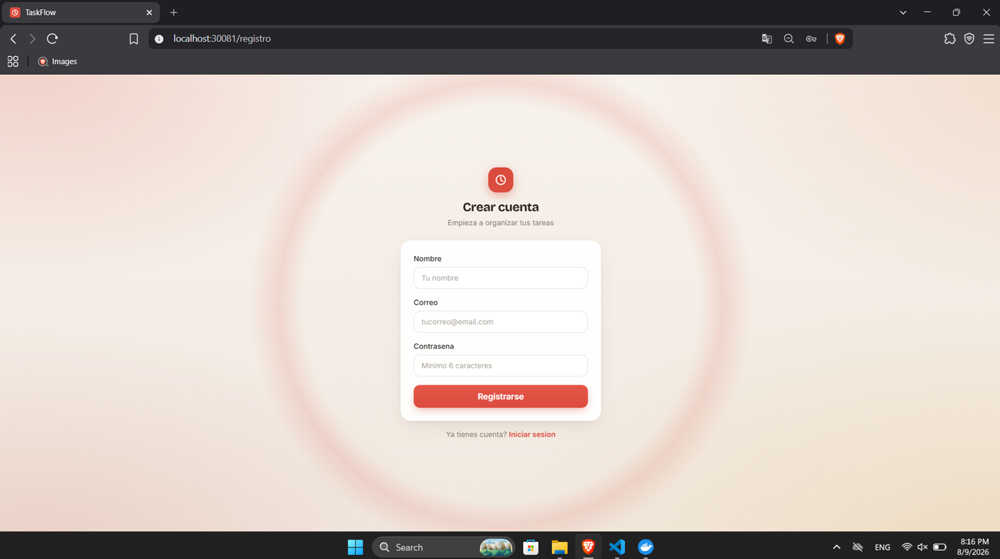 | 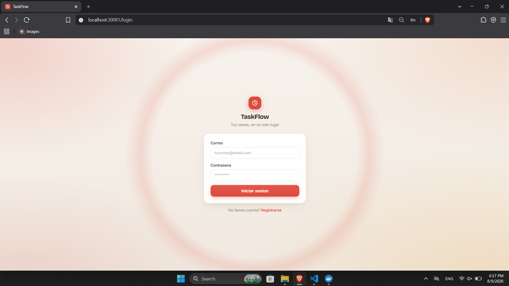 |
| Registro | Inicio de sesión |
| 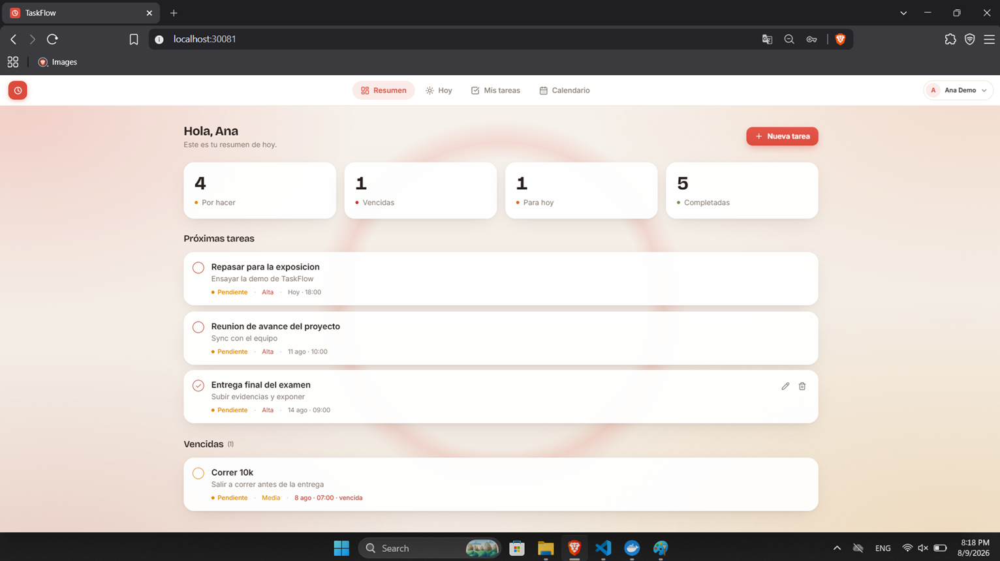 | 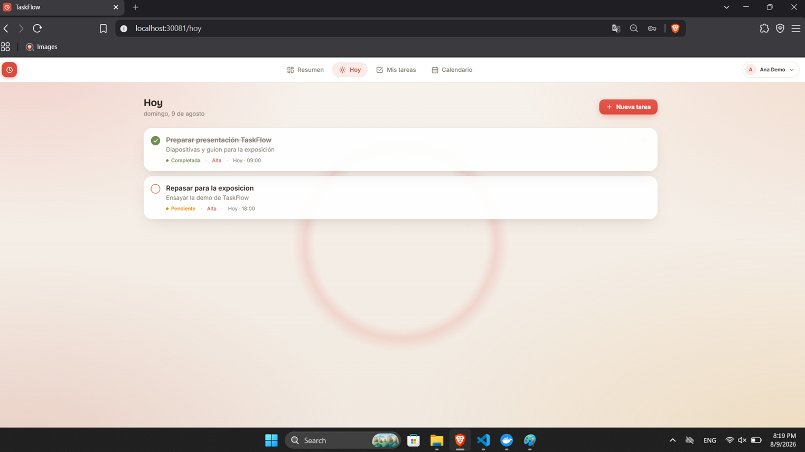 |
| Resumen con indicadores | Hoy |
| 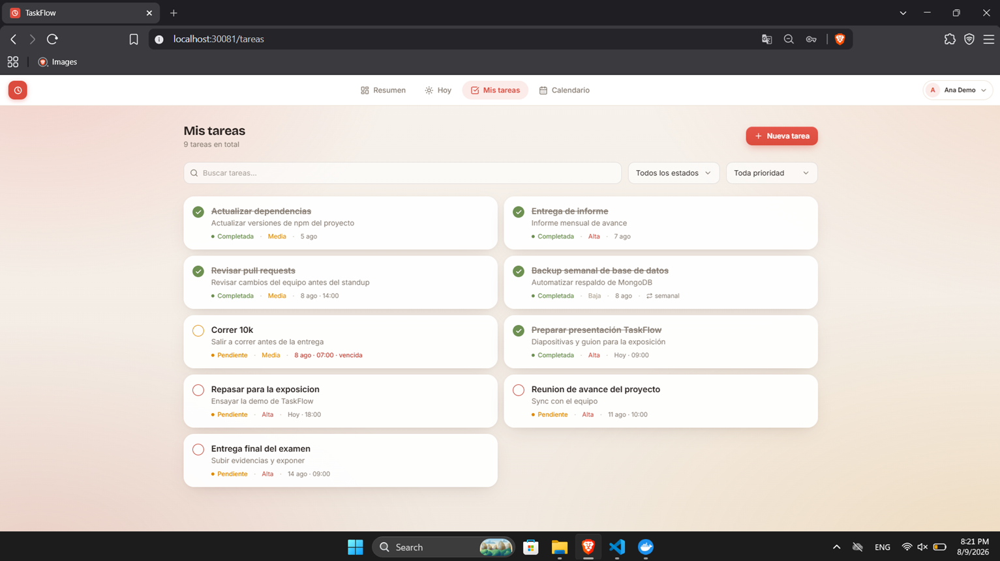 | 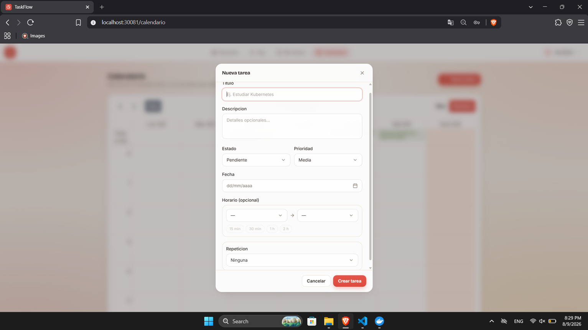 |
| Mis tareas con filtros | Crear tarea |
| 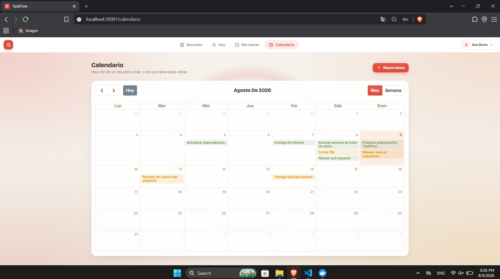 | 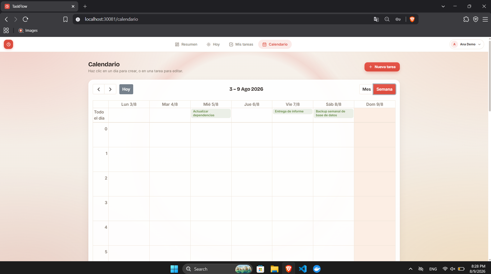 |
| Calendario (mes) | Calendario (semana) |
| 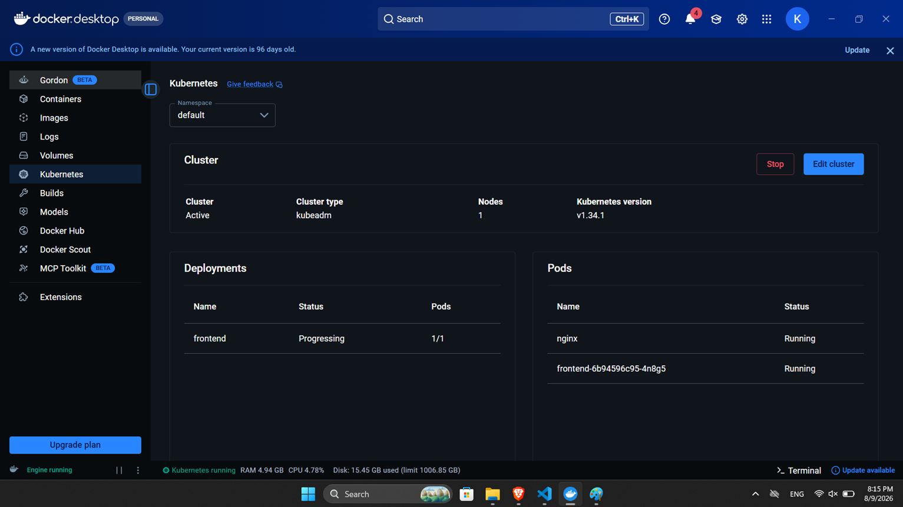 | 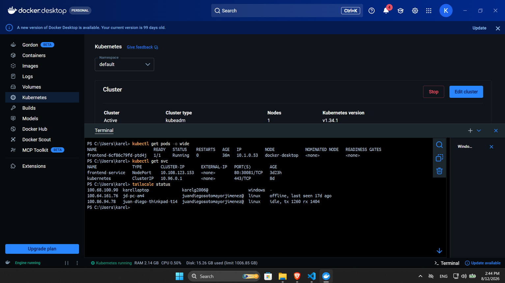 |
| Kubernetes en Docker Desktop | `kubectl get pods/services` y `tailscale status` |
| 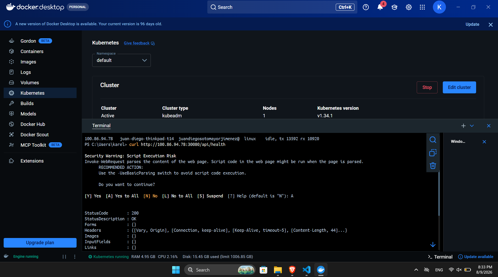 | 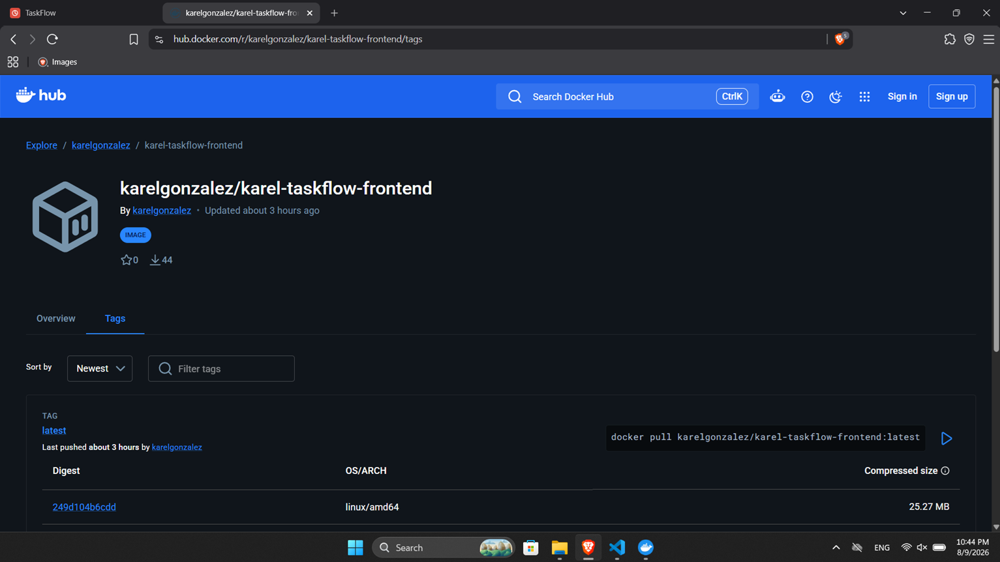 |
| Conexión cruzada al backend de la Máquina A | Imagen publicada en Docker Hub |
